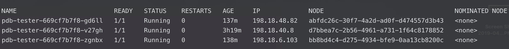
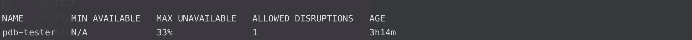
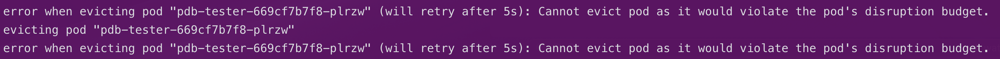

# PDB Demo

This is a demo to show the configuration and functionality of a Kubernetes PDB (Pod Disruption Budget).

## Setup

- Open 3 terminals with the appropriate KUBECONFIG context set

    - 1 for interactive work

        - Create Namespace

            ```
            $ kubectl create ns pdb-test
            ```

        - Deploy workload

            ```
            $ kubectl apply -f pdb-tester-deploy.yaml -n pdb-test
            ```

        - Deploy PDB

            ```
            $ kubectl apply -f pdb-tester-pdb.yaml -n pdb-test
            ```

    - 1 for watching the pods

        ```
        $ watch kubectl get pods -n pdb-test -o wide
        ```

        

    - 1 for watching the PDB

        ```
        $ watch kubectl get pdb -n pdb-test pdb-tester
        ```

        

## Walkthrough

- Show Sample workload with liveness/readiness probe

    ```
    $ kubectl get deploy -n pdb-test pdb-tester -o yaml
    ```

- Show PDB configuration

    ```
    $ kubectl get pdb -n pdb-test pdb-tester -o yaml
    ```

- Show Pods running across different nodes

    ```
    $ kubectl get pods -n pdb-test -o wide
    ```

- Show how a single node drain affects the workload

    ```
    $ kubectl drain <node_name> --ignore-daemonsets --delete-local-data
    ```

    - Watching secondary windows showing the pod recreation and wait for probes

    - Watch PDB metrics update based on currently unavailable pods

- Show concecutive drain operations being blocked by PDB

    ```
    $ kubectl drain <node_name1> --ignore-daemonsets --delete-local-data; sleep 5; k drain <node_name2> --ignore-daemonsets --delete-local-data
    ```

    
